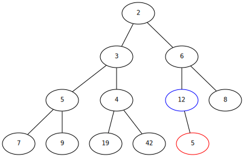
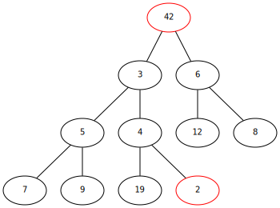
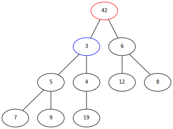
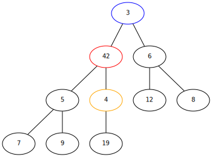

# Introduction

This is a small library implementing the heap datastructure for heapsort
and the like.

## ToC

1. [Introduction to Heaps](#Intro) 
2. [Basic Usage](#Basic%20Usage)
3. [Heap Sort](#Heap%20Sort)


## What is a heap?

A heap is a very useful tree based datastructure, that can be conveniently
represented as an array/slice. Abstractly speaking, a (binary) heap is an
almost complete (binary) tree. Since binary heaps are the most common type of heaps, we will refer to them simply as heaps. An example for a heap could look like this:


As you can see, each horizontal cross-section of the heap contains twice as
many items as its precessor. The bottom level _can_ contain twice as many, but
does not need to (only the last level does not need to be complete).

Each circled number in the heap is called a _node_. If two nodes are directly
linked, the node that's higher up is called _parent_, the lower one
_child_. The top node is called _root_ and nodes without any children are
called _leaves_. In a binary tree, each node can have up to two children at most, ternary trees would allow for up to three etc.

Starting at the top (root) node and walking right and down the heap, one can
write the heap as an array: `[2, 3, 6, 5, 4, 12, 8, 7, 9, 19, 42]`. Indexing
this array is surprisingly simple: Given a node at position `i`, the index of
its left child node (if it exists) is `2*i + 1`, and for the right child node
`2*i + 2`. this rule ___only___ applies to binary heaps, but similar rules exist for other types of heaps.

## MAX and MIN Heaps

Heaps on their own aren't really that useful, since they are too general. We
can add another contraint by introducing a _max heap_ or _min heap_
criterium, i.e. each node `n` in the heap has to be _bigger or equal_ (max heap)
or _smaller or equal_ to its child nodes.

The heap we we just looked at is, in fact, a min heap. You can check by
comparing each node to its child nodes.

Min/max heaps are useful for sorting, because it's guaranteed, that the root
node is the biggest/smalles node in the entire heap.


# Basic Usage

## Building a Heap

We can always build a heap from an array by swapping its elements until the array conforms to the min/max heap criterium. This package does this by calling the `HeapifyUp(nodeIndex int)` method repeatedly on all non-leaf nodes in reverse order (root is heapified last).

`HeapifyUp()` works like this:

1. Pick node `n` at position `nodeIndex` in array
2. Compare it with its parent node `np`
3. If `p < pn` (for max heap) / `p > pn` (min heap):
    - set `nodeIndex` to index of `p` 
    - swap `n` and `pn`
    - Go to step (1.)
4. Done.


## Inserting into a Heap

Inserting a new node into the heap is simple. ` Insert(key interface{}, score int)` creates a new `node` with the key (basically the name of the node) `key` and the score (which is what we we use to compare the size of nodes) `score` and inserts it into the heap without disrupting the min/max heap property.

This is achieved by:

1. Appending the `node` to the end of the underlying slice
2. Re-heapifying the resulting slice by calling `HeapifyUp()` on the appended node


### Example – Inserting into a Min Heap

Consider this min heap:

```
               array
                ↓
<------------------------------->
[2, 3, 6, 5, 4, 12, 8, 9, 19, 42]
<------------------------------->
                ↑
               heap
```


We want to insert a new `node` with score 5 into this heap. First we'll append it to the underlying slice:


```
                array
                  ↓
<---------------------------------->
[2, 3, 6, 5, 4, 12, 8, 9, 19, 42, 5]
<---------------------------------->
                  ↑
                heap
```



Comparing node `5` with its parent node `12`, we can immediately spot, that the min heap property is violated. To fix this, we need ro reheapify:

We will swap `5` and `12`, and then repeat the last step for the new position `5` ends up in.

```
                array
                  ↓
<---------------------------------->
[2, 3, 6, 5, 4, 5, 8, 9, 19, 42, 12]
<---------------------------------->
                  ↑
                heap
```


The new parent node of `5` is `6`. Since `6 > 5`, we need to swap the nodes again:

```
                array
                  ↓
<---------------------------------->
[2, 3, 5, 5, 4, 6, 8, 9, 19, 42, 12]
<---------------------------------->
                  ↑
                heap
```


We are now finished, since the parent node of `5` is `2`, and `5 <= 2`.

## Extracting from a Heap

Since the root node of a (min/max)Heap is always the smallest/biggest node, a
heap can be used as a priority queue or for sorting. We want to be able to
remove the root node and somehow end up with a smaller heap, that we can
extract from again efficiently. This is realized by the `ExtractTop()` method,
which extracts (removes from heap and returns to us) the top node and restores
the remaining heap by calling `HeapifyDown()`.

There is also a `DeleteTop()` method, which works the same, but does not return
the root node.

`ExtractTop()` works like this:

1. Swap root node with last node
2. Shrink the size of the heap by one (heap holds a slice of the original array)
3. Call `HeapifyDown() on the new root node:
    1. `Set `nodeIndex` to `0` (index of new root node)
    2. Pick the biggest/smallest child node `cn` of node `n` at index `nodeIndex`.
    3. If `cn < n` (max heap) / `cn > n` (min heap):
        - Set `nodeIndex` to the index of `cn`
        - Swap `cn` and `n`
        - Go to (ii.)
4. Done.


### Example - Extracting from Min Heap

Let's extract from our trusty heap from earlier:
```
               array
                ↓
<------------------------------->
[2, 3, 6, 5, 4, 12, 8, 9, 19, 42]
<------------------------------->
                ↑
               heap
```


First, we swap the root node with the last node (highlight in red):

```
               array
                ↓
<------------------------------->
[42, 3, 6, 5, 4, 12, 8, 9, 19, 2]
<------------------------------->
                ↑
               heap
```



Now, we'll shrink the size of the heap. The underlying array stays unchanged,
but our heap no longer has access to the last element:

```
               array
                ↓
<------------------------------->
[42, 3, 6, 5, 4, 12, 8, 9, 19, 2]
<---------------------------->
                ↑
               heap
```



Next we'll call `HeapifyDown()`. First we'll identify the smallest child node `cn` (blue) of the current node `n` (red, root node).

From the child nodes `3` and `6` choose `cn = 3`. Since `cn < 42`, we swap them. The former child node is now on top:



```
               array
                ↓
<------------------------------->
[3, 42, 6, 4, 5, 12, 8, 9, 19, 2]
<---------------------------->
                ↑
               heap
```

Next, we repeat the procedure at the position of the former child node. We just swapped it with the root node, so it holds the value `42`.

We identify the smallest child node of `42`, which is `4` (orange). Since `4 < 42`, we swap them:


```
               array
                ↓
<------------------------------->
[3, 4, 6, 42, 5, 12, 8, 9, 19, 2]
<---------------------------->
                ↑
               heap
```

Finally, we repeat the procedure at the position of the former child node for one last time.

We identify the smallest child node of `42`, which is `19` (blue). Since `19 < 42`, we swap them:


```
               array
                ↓
<------------------------------->
[3, 4, 6, 19, 5, 12, 8, 9, 42, 2]
<---------------------------->
                ↑
               heap
```

Since `42` is now a leaf node (has no children) we're done. We would also be done, if `42` was not a leaf node, but its children were all bigger than or equal to 42.


## Peeking

We can easily get the smalles/largest element of a min/max heap. Instead of
`Extract()`ing the root node, we can simply return a copy of it via `
Peek(1)`.

More interestingly, we can also return the top n elements of a heap via `Peek(n)`, without needing to destroy the underlying heap it via
extraction. This process is a bit complicated and involves an extra auxiliary
heap, in which we store pointers to the nodes and their positions of the
original heap. If it is of interest, I can dedicate a bigger section to it
later.


# Heap Sort

We can sort an array or slice `arr`, by using a slice `slice := arr[:]` of it
to build a (min/max) heap. The root node will be the biggest/smallest node in
the array.

We will then swap the last element of the heap with the root node, and shrink
the capacity of the slice by one `slice = slice[:len(slice)]`, and modify the
heap to satisfy the min/max heap criterium again (heapify) in `O(log(n))` time.

This effectively moved the biggest/smallest node to the end of the array, while
shrinking the slice of the array (that the heap will modify) by one. Repeating
this process until the heap is empty will then completely sort the array.


## Example for a Min Heap

```
           array
             ↓
<------------------------->
[0, 2, 1, 6, 4, 28, 31, 42]
<------------------------->
             ↑
            heap
```
Swapping root node with last node:
```
           array
             ↓
<------------------------->
[42, 2, 1, 6, 4, 28, 31, 0]
<------------------------->
             ↑
            heap

```
Shrinking heap:
```
           array
             ↓
<------------------------->
[42, 2, 1, 6, 4, 28, 31, 0]
<---------------------->
             ↑
            heap
```
Heapify
```
           array
             ↓
<------------------------->
[1, 2, 28, 6, 4, 42, 31, 0]
<---------------------->
           ↑
          heap

```
Swapping, shrinking and heapifying again:
```
           array
             ↓
<------------------------->
[2, 4, 28, 6, 31, 42, 1, 0]
<------------------>
        ↑
       heap
```

Repeat until done...

```
             .
             .
             .

```
```

           array
             ↓
 <------------------------->
 [42, 31, 28, 6, 4, 2, 1, 0]
<>
↑
heap (empty)
```

Once we've removed all nodes from the
heap, the underlying array will have been sorted.


## Sorting non-integers

Sorting arrays of non-number items usually requires a comparison criterium,
i.e. we want to know whether `item1 > item2` is `true`. There is no
universal solution to this problem (or more precisely: the solution depends on
the problem you want to solve). 

Therefore we want to be able to define a custom scoring-function. We can then
assign a score to each item, and apply a comparison sort (e.g. heap sort,
quick sort, merge sort ...). This is realized by  saving nodes as pairs of
`key`s and `score`s.

# What's next?

Migrate from `node` as a struct to just having a key and a score slice per
heap. Using nodes as tuples is a really impractical idea that leads to a lot
of copying values around.
